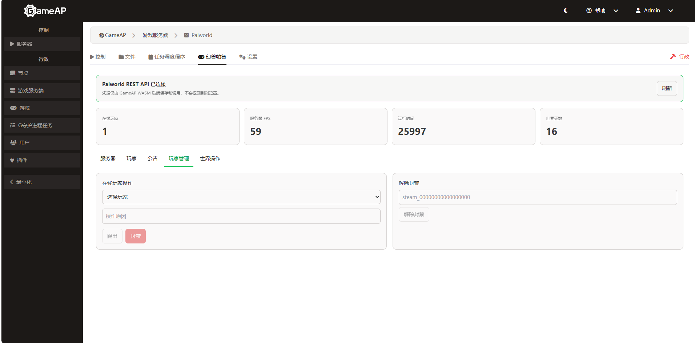

# GameAP Palworld REST Control

[English](README.md) | 中文

这个插件给 GameAP 加了个 Palworld 服务器管理标签页。后端用 WASM 代理 Palworld REST API。

## 运行截图

| 服务器 | 玩家 | 公告 |
|:---:|:---:|:---:|
|  |  |  |

| 玩家管理 | 世界观 |
|:---:|:---:|
|  |  |

## 功能

- 查看服务器状态、在线玩家、性能指标
- 踢人、封禁、解封
- 发公告
- 保存世界、安全关服、强制停止
- 每个服务器实例独立配置 REST 连接
- 管理员才能操作

## 环境要求

- Go 1.26+
- Node.js 20 或 22
- pnpm
- Docker Desktop（开了 WSL 2）

## 目录结构

```
GameAP-Palworld-Plugin\
├─ frontend\              # Vue 前端
│  ├─ src\
│  │  ├─ index.ts
│  │  └─ PalworldTab.vue
│  ├─ dist\               # 前端构建产物
│  ├─ package.json
│  └─ vite.config.js
├─ main.go                # WASM 后端
├─ go.mod
├─ go.sum
├─ dist\                  # WASM 构建产物
│  └─ gameap-palworld-plugin.wasm
├─ docs\                  # 截图
├─ build.ps1              # 一键构建脚本
└─ README.md
```

## 构建

### 一键构建

```powershell
.\build.ps1
```

### 手动构建

装前端依赖：

```powershell
cd frontend
pnpm install
```

如果 pnpm 报 esbuild 的错：

```powershell
node node_modules\esbuild\install.js
```

构建前端：

```powershell
pnpm run build
```

构建 WASM：

```powershell
cd ..
$env:GOOS = 'wasip1'
$env:GOARCH = 'wasm'
$env:GOCACHE = "$(pwd)\go-cache"
$env:GOPROXY = 'https://proxy.golang.org,direct'

New-Item -ItemType Directory -Force 'dist' | Out-Null

go build -buildvcs=false -buildmode=c-shared -o 'dist\gameap-palworld-plugin.wasm' .
```

访问不了官方 Go Proxy 就换镜像：

```powershell
$env:GOPROXY = 'https://goproxy.cn,direct'
```

构建完检查一下文件：

```powershell
Get-Item 'dist\gameap-palworld-plugin.wasm'
```

## 部署

### 用 GameAP 界面安装

1. 登录 GameAP
2. 管理 → 插件 → 上传/安装
3. 选 `dist\gameap-palworld-plugin.wasm`
4. 点安装

### 用 API 安装

```powershell
$gameapUrl = 'http://localhost:8025'
$gameapAdmin = 'admin'
$gameapPassword = '你的GameAP密码'
$wasm = 'dist\gameap-palworld-plugin.wasm'

# 登录拿 token
$auth = Invoke-RestMethod -Method Post -Uri "$gameapUrl/api/auth/login" `
  -ContentType 'application/json' `
  -Body (@{login=$gameapAdmin;password=$gameapPassword} | ConvertTo-Json)
$token = if ($auth.token) {$auth.token} elseif ($auth.data.token) {$auth.data.token} else {$auth.access_token}

# 上传插件
curl.exe -sS -X POST `
  -H "Authorization: Bearer $token" `
  -F "file=@$wasm;type=application/wasm" `
  "$gameapUrl/api/admin/plugins/upload/install"
```

### 配置 REST 连接

装完插件要配置 Palworld REST 连接信息：

```powershell
$headers = @{Authorization="Bearer $token"}
$pluginId = 'h4fkd4cukuk6o'  # 在插件管理页面看实际的 ID
$serverId = 1
$palPassword = '你的Palworld管理员密码'

$config = @{
  base_url = 'http://host.docker.internal:8212/v1/api'
  username = 'admin'
  password = $palPassword
} | ConvertTo-Json

# 写入配置
Invoke-RestMethod -Method Post `
  -Uri "$gameapUrl/api/plugins/$pluginId/servers/$serverId/config" `
  -Headers $headers -ContentType 'application/json' -Body $config

# 验证密码没被返回
Invoke-RestMethod `
  -Uri "$gameapUrl/api/plugins/$pluginId/servers/$serverId/config" `
  -Headers $headers
```

返回里应该只有 `configured`、`base_url`、`username`，没有密码。

## GameAP 容器配置

在 `docker-compose.local.yml` 里加：

```yaml
services:
  gameap:
    environment:
      PLUGIN_HTTP_ALLOWED_SCHEMES: http,https
      PLUGIN_HTTP_ALLOWED_HOSTS: host.docker.internal
```

只能访问 `host.docker.internal`，别乱开内网地址。

## API 接口

读取：

```powershell
$base = "$gameapUrl/api/plugins/$pluginId/servers/$serverId"

Invoke-RestMethod "$base/info" -Headers $headers      # 服务器信息
Invoke-RestMethod "$base/players" -Headers $headers    # 在线玩家
Invoke-RestMethod "$base/settings" -Headers $headers   # 设置
Invoke-RestMethod "$base/metrics" -Headers $headers    # 指标
```

管理：

```powershell
# 发公告
Invoke-RestMethod -Method Post -Uri "$base/announce" `
  -Headers $headers -ContentType 'application/json' `
  -Body (@{message='测试公告'} | ConvertTo-Json)

# 保存世界
Invoke-RestMethod -Method Post -Uri "$base/save" -Headers $headers

# 踢人（用 userId，不是昵称）
$userId = 'steam_00000000000000000'
Invoke-RestMethod -Method Post -Uri "$base/kick" `
  -Headers $headers -ContentType 'application/json' `
  -Body (@{userid=$userId;message='违规'} | ConvertTo-Json)

# 封禁
Invoke-RestMethod -Method Post -Uri "$base/ban" `
  -Headers $headers -ContentType 'application/json' `
  -Body (@{userid=$userId;message='违规'} | ConvertTo-Json)

# 解封
Invoke-RestMethod -Method Post -Uri "$base/unban" `
  -Headers $headers -ContentType 'application/json' `
  -Body (@{userid=$userId} | ConvertTo-Json)
```

服务控制：

```powershell
# 安全关服（会联动停止 GameAP 服务）
Invoke-RestMethod -Method Post -Uri "$base/shutdown" -Headers $headers

# 强制停止
Invoke-RestMethod -Method Post -Uri "$base/stop" -Headers $headers

# 启动
Invoke-RestMethod -Method Post -Uri "$gameapUrl/api/servers/$serverId/start" -Headers $headers
```

安全关服和强制停止都要联动 GameAP 服务，不能单独调 Palworld REST。

## 常见问题

### 点插件导致 GameAP 登出

Palworld REST 返回 401/403 时，WASM 后端会转成 502，不会触发 GameAP 登出。如果你遇到了，检查是不是前端直接调了 Palworld REST。

### 按钮没反应

- 公告不能为空
- 踢人/封禁要选在线玩家
- 解封要填完整 `userId`
- 刷新页面看看有没有报错
- 浏览器 `Ctrl+F5` 清缓存

### 关服后又自动启动

这是因为 Shawl 包装器会自动重启。正确流程：

1. 调 Palworld `/shutdown`
2. 马上调 GameAP `/api/servers/{id}/stop`
3. 等服务停止、进程数为 0

### 世界快照返回 501

当前 Palworld 版本不支持这个功能，插件会返回 501。其他功能正常。

### esbuild 安装失败

```powershell
cd frontend
node node_modules\esbuild\install.js
node node_modules\vite\bin\vite.js build
```

### Go 缓存问题

```powershell
$env:GOCACHE = "$(pwd)\go-cache"
go clean -cache
go build -buildvcs=false -buildmode=c-shared -o 'dist\gameap-palworld-plugin.wasm' .
```

## 更新插件

改了前端或后端代码后：

```powershell
# 构建
.\build.ps1

# 在 GameAP 卸载旧插件
# 上传新 wasm
# 重新配置 REST 连接
# 重启容器
docker restart gameap

# 浏览器 Ctrl+F5
```

## 调试

看日志：

```powershell
docker logs gameap --tail 100 -f
docker logs gameap 2>&1 | Select-String -Pattern "plugin|palworld"
```

测试 Palworld REST 连通性：

```powershell
$pair = [Convert]::ToBase64String([Text.Encoding]::ASCII.GetBytes("admin:你的密码"))
Invoke-RestMethod 'http://localhost:8212/v1/api/info' -Headers @{Authorization="Basic $pair"}
```

看已安装插件：

```powershell
Invoke-RestMethod "$gameapUrl/api/admin/plugins/loaded" -Headers $headers
```

## 许可证

MIT
