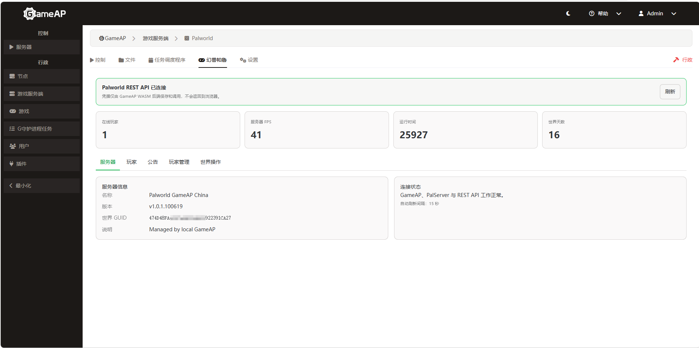
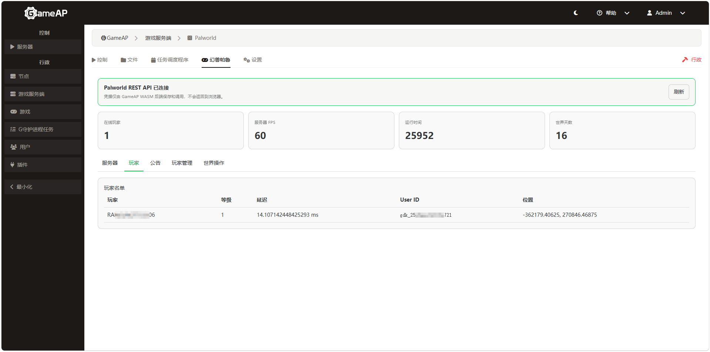
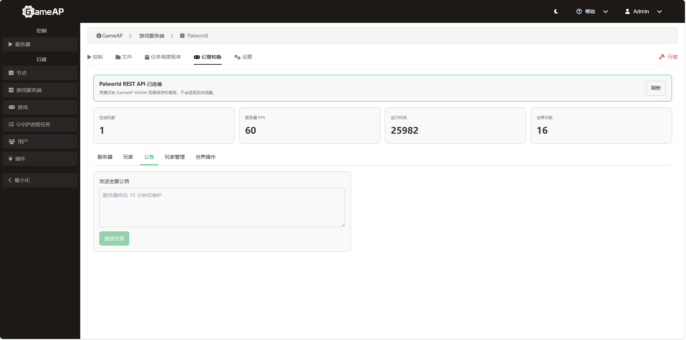
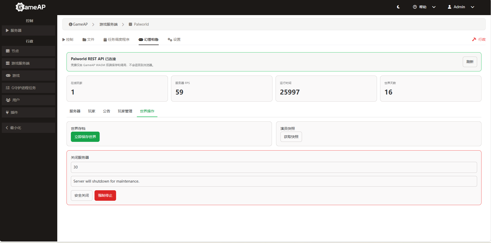

# GameAP Palworld REST Control v1.0.0

GameAP 原生 Palworld 服务器管理插件。通过 WASM 后端代理官方 Palworld REST API，浏览器永远不会暴露密码。

## 运行截图

| 服务器 | 玩家 | 公告 |
|:---:|:---:|:---:|
|  |  |  |

| 玩家管理 | 世界观 |
|:---:|:---:|
|  |  |

## 功能特性

- **服务器信息**：实时查看服务器状态、在线玩家、性能指标
- **玩家管理**：踢出、封禁、解封玩家
- **公告系统**：向全服发送公告消息
- **世界管理**：保存世界、安全关服、强制停止
- **配置隔离**：每个服务器实例独立配置 REST 连接
- **安全代理**：WASM 后端代理 REST API，密码不暴露给浏览器
- **权限控制**：管理员才能操作

## 安装方法

### 1. 下载插件

下载 `gameap-palworld-plugin.wasm`（前端和后端已包含在此文件中）

### 2. 安装到 GameAP

**方式一：GameAP 界面（推荐）**

1. 登录 GameAP 管理面板
2. 进入 `管理 → 插件 → 上传/安装`
3. 选择 `gameap-palworld-plugin.wasm`
4. 点击安装

**方式二：API**

```powershell
$gameapUrl = 'http://localhost:8025'
$gameapAdmin = 'admin'
$gameapPassword = '你的GameAP密码'
$wasm = 'gameap-palworld-plugin.wasm'

# 登录获取 token
$auth = Invoke-RestMethod -Method Post -Uri "$gameapUrl/api/auth/login" `
  -ContentType 'application/json' `
  -Body (@{login=$gameapAdmin;password=$gameapPassword} | ConvertTo-Json)
$token = $auth.token

# 上传安装插件
curl.exe -sS -X POST `
  -H "Authorization: Bearer $token" `
  -F "file=@$wasm;type=application/wasm" `
  "$gameapUrl/api/admin/plugins/upload/install"
```

### 3. 配置 Palworld REST 连接

```powershell
$headers = @{Authorization="Bearer $token"}
$pluginId = 'h4fkd4cukuk6o'  # 在插件管理页面查看实际 ID
$serverId = 1
$palPassword = '你的Palworld管理员密码'

$config = @{
  base_url = 'http://host.docker.internal:8212/v1/api'
  username = 'admin'
  password = $palPassword
} | ConvertTo-Json

# 写入配置
Invoke-RestMethod -Method Post `
  -Uri "$gameapUrl/api/plugins/$pluginId/servers/$serverId/config" `
  -Headers $headers -ContentType 'application/json' -Body $config
```

### 4. 配置 GameAP 容器

在 `docker-compose.local.yml` 中添加：

```yaml
services:
  gameap:
    environment:
      PLUGIN_HTTP_ALLOWED_SCHEMES: http,https
      PLUGIN_HTTP_ALLOWED_HOSTS: host.docker.internal
```

重启容器：`docker restart gameap`

## 使用说明

安装配置完成后，在 GameAP 服务器管理页面会多出一个 Palworld 标签页：

- **服务器**：查看服务器状态、版本、在线时间
- **玩家**：查看在线玩家列表、踢出、封禁、解封
- **公告**：向全服发送公告消息
- **玩家管理**：管理玩家封禁列表
- **世界观**：查看游戏世界设置

## 注意事项

- 管理员才能操作
- 安全关服会联动停止 GameAP 服务包装器
- Palworld REST API 不要暴露公网
- 更多详情请查看 [README](https://github.com/RANSUROTTO/GameAP-Palworld-Plugin/blob/main/README.md)

## 环境要求

- GameAP 面板（Docker 部署）
- Palworld Dedicated Server（启用 REST API）
- Windows 或 Linux 服务器
